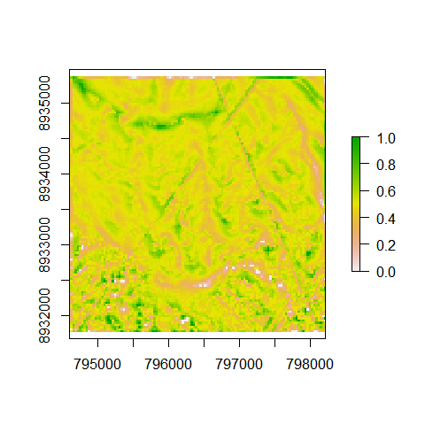

<!-- README.md is generated from README.Rmd. Please edit that file -->
GeoMorphTB is an open-source approach for Evan's ArcGIS Geomorphometry & Gradient Metrics Toolbox ([here](http://evansmurphy.wixsite.com/evansspatial/arcgis-gradient-metrics-toolbox)). As open-source software solution GRASS GIS 7.x is used through [RQGIS](https://github.com/jannes-m/RQGIS) functionalities.

Currently, the following functions and algorithms are supported: \* Directionality + Classify Aspect + Linear Aspect + Mean Slope \* Statistics + Correlation \* Surface Texture + Dissection + Landform + Roughness + Roughness Index (Add-on, Cavalli et al. 2008) + Slope Position + Surface Area Ratio + Surface Relief Ratio \* Temperature and Moisture + 2nd Derivative Slope + Site Exposure Index + Slope/Aspect Transformation

Installation
============

Package installation
--------------------

In order to use GeoMorphTB, RQGIS needs to be installed properly (see `vignette("install_guide", package = "RQGIS")`).

You can install:

-   the latest GeoMorphTB development version from Github with:

``` r
devtools::install_github("raff-k/GeoMorphTB")
```

GeoMorphTB usage
================

The usage of GeoMorphTB is straightforward, simply based on the need of a digital elevation model. In the following example we gonna use the dem of the RQGIS-package.

``` r
# attach packages
library("raster")
library("RQGIS")

# set the RQGIS-environment
RQGIS::set_env()
```

    ## $root
    ## [1] "C:/OSGeo4W64"
    ## 
    ## $qgis_prefix_path
    ## [1] "C:/OSGeo4W64/apps/qgis"
    ## 
    ## $python_plugins
    ## [1] "C:/OSGeo4W64/apps/qgis/python/plugins"

``` r
# get digital elevation model 
dem <- RQGIS::dem
# dem is of class "RasterLayer"
```

Now, we can already start computing the implemented gradient and geomorphometric parameters.

``` r
# attach RQGIS
library("GeoMorphTB")

# computation of dissection
dis <- GeoMorphTB::dissection(elevation = dem)

# get summary and plot of result
summary(raster::values(dis))
```

    ##    Min. 1st Qu.  Median    Mean 3rd Qu.    Max. 
    ##  0.0000  0.4516  0.5000  0.4963  0.5429  1.0000

``` r
raster::plot(dis)
```



The result of the function is automatically loaded into R. However, if you do not want the file loaded in R, but stored on the hard disk, you can specify the function call as in the following example:

``` r
# as default, the file is saved to current working directory
GeoMorphTB::roughness(elevation = dem, load_output = FALSE, output = file.path(tempdir(), "roughness.tif"))
```
